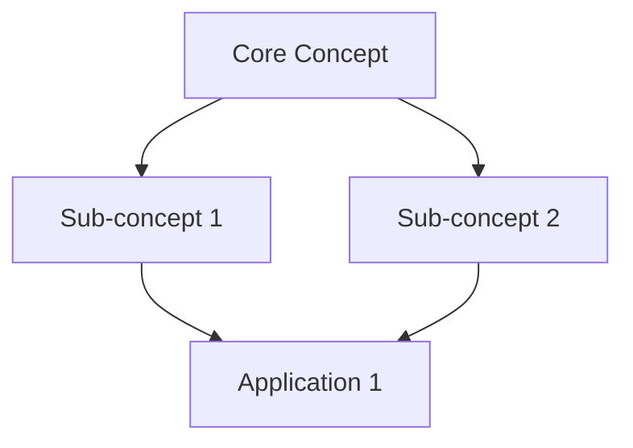

# EPUB Book Notes Generator

## Overview

This skill enables comprehensive note-taking from EPUB books by extracting the full content and generating two types of structured notes:

1. **Chapter Notes**: Detailed summaries for each chapter including key concepts, examples, conclusions, visualizations, related knowledge, and common misconceptions
2. **Concept Notes**: Individual knowledge point explanations with definitions, examples, cross-references, and practical applications

The generated notes are detailed, well-structured, and designed for deep learning and future reference.

## When to Use

Use this skill when:
- User provides an EPUB file path and requests note generation
- User asks to "read", "analyze", or "extract content" from an EPUB book
- User wants structured learning materials from technical or professional books
- User requests chapter summaries or concept explanations from EPUB files

**Example triggers:**
- "提取 machine-learning.epub 的内容生成笔记"
- "帮我阅读这本《深度学习》并生成各章节笔记"
- "从这个 EPUB 文件生成知识点笔记"
- "Generate comprehensive notes from book.epub"

## Workflow

### Step 1: Validate and Prepare

Before starting, verify:
1. **EPUB file exists**: Check the provided file path
2. **Dependencies installed**: Ensure required Python packages are available
3. **Working directory**: Confirm Claude Code is running in the same directory as the EPUB file (or adjust paths accordingly)

If dependencies are missing, install them:
```bash
pip install ebooklib beautifulsoup4 lxml
```

### Step 2: Extract EPUB Content

Use the provided `scripts/extract_epub.py` script to parse the EPUB file and extract all content:

```bash
python scripts/extract_epub.py <epub_file_path> --output book_content.json --pretty
```

**What this does:**
- Extracts book metadata (title, author, publisher, etc.)
- Parses the table of contents structure
- Extracts all chapter content as clean text
- Outputs structured JSON with metadata, TOC, chapters, and statistics

**Script outputs:**
```json
{
  "metadata": {
    "title": "Book Title",
    "authors": ["Author Name"],
    "language": "en",
    "publisher": "Publisher",
    "date": "2023",
    "description": "...",
    "identifier": "ISBN..."
  },
  "toc": [
    {"title": "Chapter 1", "href": "chapter1.xhtml", "level": 0},
    ...
  ],
  "chapters": [
    {
      "chapter_number": 1,
      "title": "Chapter Title",
      "file_name": "chapter1.xhtml",
      "content": "Full chapter text...",
      "word_count": 2500
    },
    ...
  ],
  "stats": {
    "total_chapters": 12,
    "total_words": 50000
  }
}
```

Read the JSON output to access the extracted content for note generation.

### Step 3: Analyze Content Structure

After extraction:
1. **Review the table of contents**: Understand the book's structure
2. **Identify chapter count**: Determine how many chapter notes to create
3. **Scan for key concepts**: Read through chapters to identify recurring concepts, technical terms, and important ideas that warrant individual concept notes
4. **Plan the note structure**: Decide on the organization of `chapters/` and `concepts/` directories

### Step 4: Create Note Directory Structure

Create the organized directory structure for the notes:

```bash
mkdir -p book-notes/chapters
mkdir -p book-notes/concepts
```

**Directory structure:**
```
book-notes/
├── README.md                    # Overview and index
├── metadata.json                # Book metadata (copy from extraction)
├── chapters/                    # Chapter notes
│   ├── chapter-01.md
│   ├── chapter-02.md
│   └── ...
└── concepts/                    # Concept notes
    ├── [concept-name].md
    ├── [concept-name].md
    └── ...
```

### Step 5: Generate Chapter Notes

For each chapter in the extracted content, create a comprehensive chapter note following the standard format defined in `references/note_template.md`.

**Important: Read the template before generating notes!**

Read `references/note_template.md` to understand the required structure.

**Completeness is critical:**
- Do NOT skip or summarize content too briefly
- Include ALL important concepts, examples, and conclusions
- Maintain sufficient detail to support deep understanding
- Preserve context for each concept and example

**Naming convention:**
- `chapter-01.md`, `chapter-02.md`, etc.
- Or: `chapter-01-[title].md` with descriptive titles

### Step 6: Extract and Generate Concept Notes

After generating chapter notes, identify key concepts that appear across multiple chapters or are central to understanding the book. Create individual concept notes for these knowledge points.

**How to identify concepts for extraction:**
1. **Recurring terms**: Concepts mentioned in multiple chapters
2. **Technical vocabulary**: Domain-specific terminology requiring detailed explanation
3. **Core principles**: Fundamental ideas central to the book's theme
4. **Complex topics**: Subjects that benefit from dedicated, focused explanation

**For each concept, create a detailed note** following the concept template in `references/note_template.md`:

1. **🎯 One-line Summary** (一句话概括)
2. **📖 Detailed Definition** (详细定义)
   - Academic definition, plain language explanation, core elements
3. **🧠 Deep Understanding** (深度理解)
   - Origin, theoretical foundation, working principles, key characteristics
4. **💡 Concrete Examples** (具体示例)
   - Multiple examples from different angles
5. **📚 Appearances in Book** (在书中的出现)
   - Track where this concept appears across chapters
6. **🔗 Related Concepts** (关联概念)
   - Prerequisites, related concepts, contrasting concepts
7. **🎯 Application Scenarios** (应用场景)
8. **⚠️ Common Misunderstandings** (常见误解)
9. **📊 Importance Analysis** (重要性分析)
10. **🛠️ Practical Advice** (实践建议)
11. **📝 Memory Points** (记忆要点)

**Naming convention:**
- Use the concept name as the filename
- Examples: `机器学习.md`, `神经网络.md`, `gradient-descent.md`
- Use hyphens for multi-word English terms
- Avoid special characters

### Step 7: Create README and Index

Create a comprehensive `README.md` in the `book-notes/` directory to serve as the main index:

```markdown
# [Book Title] 读书笔记

> **作者**：[Authors]
> **出版社**：[Publisher]
> **ISBN**：[ISBN]
> **语言**：[Language]
> **笔记生成日期**：[Date]

## 📖 书籍概览

[Brief book introduction from metadata or first chapter]

## 📚 目录

### 章节笔记
1. [第 1 章：Title](chapters/chapter-01.md) - [Brief description]
2. [第 2 章：Title](chapters/chapter-02.md) - [Brief description]
...

### 💡 概念索引

按字母/拼音排序，按类别组织：

#### 基础概念
- [概念 A](concepts/概念A.md) - [One-line description]
- [概念 B](concepts/概念B.md) - [One-line description]

#### 高级主题
- [概念 X](concepts/概念X.md) - [One-line description]
- [概念 Y](concepts/概念Y.md) - [One-line description]

## 📊 统计信息

- **总章节数**：X
- **总概念数**：Y
- **总字数**：~Z 词
- **预计阅读时间**：约 W 小时

## 🗺️ 知识图谱

[Optional: Create a Mermaid diagram showing relationships between major concepts]



## 📌 快速导航

### 按主题浏览
- **[主题 1]**: 相关章节和概念
- **[主题 2]**: 相关章节和概念

### 推荐阅读路径
1. 初学者路径：[章节列表]
2. 进阶路径：[章节列表]
3. 专题路径：[章节列表]

## 💡 学习建议

[Provide learning recommendations based on book structure]

---

*This note collection was AI-assisted and generated from the EPUB source.*
```

Also copy the metadata to `metadata.json`:
```json
{
  "title": "Book Title",
  "authors": ["Author Name"],
  ...
}
```

### Step 8: Quality Check

Before completing, verify:

✅ **Completeness**:
- All chapters have corresponding notes
- All key concepts are documented
- No important information is omitted

✅ **Structure**:
- All notes follow the template format
- Consistent heading hierarchy
- Proper Markdown formatting

✅ **Cross-references**:
- Concept notes link to relevant chapters
- Chapter notes reference related concepts
- README provides comprehensive navigation

✅ **Detail Level**:
- Notes are sufficiently detailed (not overly summarized)
- Examples are complete and clear
- Explanations are thorough

✅ **Accuracy**:
- Definitions are precise
- Technical terms are correctly explained
- No misrepresentation of the original content

## Best Practices

### Maintain Detail and Completeness
- **Don't oversimplify**: Preserve nuance and complexity from the original text
- **Include all examples**: Don't skip examples, even if they seem similar
- **Preserve context**: Always include the context in which concepts are introduced
- **Quote key passages**: When important, include direct quotes from the book

### Ensure Consistency
- **Uniform formatting**: Apply the same structure to all notes
- **Consistent terminology**: Use the same terms for concepts throughout
- **Standardized naming**: Follow the naming conventions strictly

### Build Connections
- **Link liberally**: Create abundant cross-references between notes
- **Track concept evolution**: Note how understanding of concepts develops across chapters
- **Identify patterns**: Recognize and document recurring themes and patterns

### Enhance Usability
- **Clear headings**: Use descriptive, scannable headings
- **Visual aids**: Add diagrams, tables, and visual representations
- **Quick reference**: Provide summary sections for rapid review
- **Navigation**: Ensure README provides multiple ways to access content

### Preserve Original Intent
- **Faithful representation**: Accurately reflect the author's ideas
- **Avoid interpretation bias**: Distinguish between the author's claims and your notes
- **Context preservation**: Maintain the context and nuance of the original work

## Troubleshooting

### Script Execution Issues

**Problem**: Missing dependencies
```
Error: No module named 'ebooklib'
```
**Solution**: Install required packages:
```bash
pip install ebooklib beautifulsoup4 lxml
```

**Problem**: EPUB file not found
```
Error: EPUB file not found: book.epub
```
**Solution**: Verify the file path and ensure Claude Code is running in the correct directory, or provide an absolute path.

**Problem**: Encoding errors during extraction
**Solution**: The script handles encoding errors gracefully. If persistent, check that the EPUB file is not corrupted.

### Content Quality Issues

**Problem**: Extracted text is garbled or contains HTML tags
**Solution**: The `extract_epub.py` script includes HTML cleaning. If issues persist, manually review the JSON output and clean problematic sections.

**Problem**: Chapter titles are missing or incorrect
**Solution**: The script attempts to match TOC entries to chapters. Manually correct chapter titles in the JSON if needed before generating notes.

**Problem**: Some chapters are empty or very short
**Solution**: These may be front matter or dividers. Review the extracted content and decide whether to skip or merge them.

### Note Generation Issues

**Problem**: Difficulty identifying key concepts
**Solution**:
1. Read through all chapters first
2. Create a list of recurring terms and important ideas
3. Prioritize concepts that appear in multiple chapters or are central to understanding

**Problem**: Notes are becoming too brief
**Solution**:
1. Review the template again to ensure all sections are included
2. Expand explanations to include more detail
3. Add more examples and context
4. Remember: completeness is more important than brevity

**Problem**: Visualizations are hard to create
**Solution**:
1. Use Mermaid diagrams for flowcharts and graphs
2. Use ASCII art for simple diagrams
3. Provide detailed textual descriptions when visual representation is difficult
4. Focus on clarity over aesthetics

## Resources

### scripts/extract_epub.py
Python script for extracting content from EPUB files. Requires `ebooklib`, `beautifulsoup4`, and `lxml` packages.

**Usage:**
```bash
python scripts/extract_epub.py <epub_file> --output <output.json> --pretty
```

### references/note_template.md
Comprehensive template defining the structure and format for both chapter notes and concept notes. **Read this file carefully before generating notes** to ensure consistency and completeness.

The template includes:
- Complete chapter note structure with all required sections
- Complete concept note structure with all required sections
- Note generation guidelines (completeness, structure, relationships, visualization, practicality)
- File naming conventions
- Directory organization standards
- README.md structure suggestions

## Example Usage

**Scenario**: User wants to create notes from a machine learning book

```
User: "提取 machine-learning-basics.epub 的内容生成笔记"

Claude:
1. Verify the file exists: machine-learning-basics.epub ✓
2. Check dependencies: ebooklib, beautifulsoup4, lxml ✓
3. Run extraction script:
   python scripts/extract_epub.py machine-learning-basics.epub --output book_content.json --pretty

4. Read the extracted JSON to understand structure:
   - 15 chapters detected
   - 45,000 total words
   - Topics: supervised learning, neural networks, deep learning, etc.

5. Create directory structure:
   mkdir -p machine-learning-notes/chapters
   mkdir -p machine-learning-notes/concepts

6. Generate chapter notes (15 notes):
   - chapter-01.md: "Introduction to Machine Learning"
   - chapter-02.md: "Supervised Learning Fundamentals"
   - ... (each following the template structure)

7. Identify and create concept notes (20+ concepts):
   - 机器学习.md (Machine Learning)
   - 监督学习.md (Supervised Learning)
   - 神经网络.md (Neural Networks)
   - 梯度下降.md (Gradient Descent)
   - 过拟合.md (Overfitting)
   - ... (each with detailed definition, examples, cross-references)

8. Create README.md with:
   - Book overview
   - Chapter index with descriptions
   - Concept index organized by category
   - Knowledge graph showing concept relationships
   - Learning path recommendations

9. Quality check: ✅ All chapters covered, concepts detailed, cross-references complete

Result: Comprehensive note collection ready for deep learning and reference.
```
