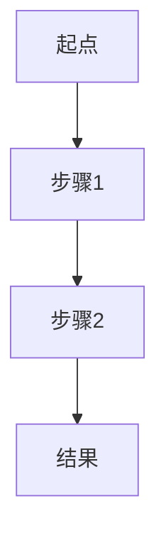

# 笔记模板参考

本文档定义了从 EPUB 书籍生成笔记的标准格式和结构。

## 章节笔记格式

每个章节笔记应该是一个独立的 Markdown 文件，位于 `chapters/` 目录下，命名格式为 `chapter-XX.md`（其中 XX 是章节编号）。

### 章节笔记结构模板

```markdown
# 第 X 章：[章节标题]

> **章节来源**：[书籍标题] - 第 X 章
> **字数统计**：约 X 词

---

## 📝 章节摘要

[简洁的章节概述，3-5 段，涵盖本章的主要主题和核心论点]

- **核心主题**：[一句话概括本章主题]
- **主要论点**：[列举 3-5 个主要论点]
- **学习目标**：[读者从本章可以学到什么]

---

## 💡 关键概念

按照出现顺序或重要性列出本章的关键概念：

### 1. [概念名称]

**定义**：[清晰准确的定义]

**详细说明**：
[详细解释概念的含义、背景、原理等]

**重要性**：[为什么这个概念重要]

---

### 2. [概念名称]

[重复上述结构...]

---

## 📚 示例与案例

### 示例 1：[示例标题]

**场景描述**：
[描述示例的背景和情境]

**具体内容**：
[详细的示例内容、代码、数据或案例分析]

**关键要点**：
- [要点 1]
- [要点 2]
- [要点 3]

---

### 示例 2：[示例标题]

[重复上述结构...]

---

## 🎯 重要结论

按优先级列出本章的重要结论和关键发现：

1. **[结论 1]**
   - **说明**：[详细阐述]
   - **应用场景**：[在什么情况下应用这个结论]
   - **影响**：[这个结论的意义和影响]

2. **[结论 2]**
   - [重复上述结构...]

3. **[结论 3]**
   - [重复上述结构...]

---

## 🎨 图解与可视化

[如果章节包含重要的图表、流程图、公式或可视化内容]

### 图解 1：[图解标题]

```
[使用 ASCII 艺术、Mermaid 图表或文字描述来展现概念关系]

示例（Mermaid 流程图）：


**图解说明**：[解释图解的含义和关键点]

---

### 图解 2：[图解标题]

[重复上述结构...]

---

## 🔗 关联知识点

列出与本章相关的其他概念、章节或外部知识：

### 前置知识
- **[知识点]**（第 X 章）：[简要说明关联关系]
- **[知识点]**（第 X 章）：[简要说明关联关系]

### 后续扩展
- **[知识点]**（第 X 章）：[简要说明关联关系]
- **[知识点]**（第 X 章）：[简要说明关联关系]

### 跨学科关联
- **[相关领域]**：[说明与其他学科的联系]
- **[实际应用]**：[说明在实际中的应用场景]

---

## ⚠️ 常见误区

列出读者容易产生的误解、常犯的错误或需要特别注意的地方：

### 误区 1：[误区标题]

**错误理解**：[描述常见的错误理解]

**正确理解**：[澄清正确的理解]

**为何容易混淆**：[解释为什么容易产生这种误解]

**避免方法**：[如何避免这个误区]

---

### 误区 2：[误区标题]

[重复上述结构...]

---

## 📌 章节总结

[用 3-5 句话总结本章的核心内容和要点]

### 核心要点速记
- [要点 1]
- [要点 2]
- [要点 3]
- [要点 4]
- [要点 5]

---

## 🤔 思考问题

[提出 3-5 个引导读者深入思考的问题]

1. [问题 1]
2. [问题 2]
3. [问题 3]

---

## 📖 进一步阅读

[如果章节提到了相关资源、参考文献或推荐阅读]

- [资源 1]：[简要说明]
- [资源 2]：[简要说明]

---

*笔记生成日期：[YYYY-MM-DD]*
*AI 辅助整理*
```

---

## 概念笔记格式

每个概念笔记应该是一个独立的 Markdown 文件，位于 `concepts/` 目录下，使用概念名称作为文件名（例如 `机器学习.md`）。

### 概念笔记结构模板

```markdown
# [概念名称]

> **知识类型**：[基础概念 / 理论框架 / 方法论 / 技术 / 原则 / 其他]
> **首次出现**：第 X 章
> **难度等级**：⭐⭐⭐☆☆
> **重要程度**：⭐⭐⭐⭐⭐

---

## 🎯 一句话概括

[用一句简洁的话定义这个概念]

---

## 📖 详细定义

[详细、准确的定义，包括：]

- **学术定义**：[正式的学术定义]
- **通俗解释**：[用简单的语言解释]
- **核心要素**：[构成这个概念的核心要素]

---

## 🧠 深度理解

### 概念起源
[这个概念的历史背景、提出者、发展历程]

### 理论基础
[支撑这个概念的理论基础]

### 工作原理
[如果适用，解释这个概念的工作原理或运作机制]

### 关键特征
1. **[特征 1]**：[详细说明]
2. **[特征 2]**：[详细说明]
3. **[特征 3]**：[详细说明]

---

## 💡 具体示例

### 示例 1：[示例标题]

**场景**：[描述场景]

**应用**：[如何应用这个概念]

**效果**：[应用后的效果]

**分析**：[深入分析这个示例如何体现概念]

---

### 示例 2：[示例标题]

[重复上述结构...]

---

### 示例 3：[示例标题]

[重复上述结构...]

---

## 📚 在书中的出现

记录这个概念在书中的所有重要出现位置：

### 第 X 章：[章节标题]
- **页码/位置**：[如果有]
- **上下文**：[在什么上下文中讨论这个概念]
- **要点**：[这一部分关于这个概念的要点]

### 第 Y 章：[章节标题]
[重复上述结构...]

---

## 🔗 关联概念

### 前置概念
理解本概念需要先掌握的概念：

- **[前置概念 1]**：[说明关系]
- **[前置概念 2]**：[说明关系]

### 相关概念
与本概念相关的其他概念：

- **[相关概念 1]**：[说明关系]
- **[相关概念 2]**：[说明关系]

### 对比概念
容易与本概念混淆的概念：

- **[对比概念 1]**
  - **相似点**：[列出相似之处]
  - **差异点**：[列出关键差异]
  - **区分方法**：[如何区分]

---

## 🎯 应用场景

列出这个概念的典型应用场景：

### 场景 1：[场景名称]
- **描述**：[场景描述]
- **如何应用**：[具体应用方法]
- **预期效果**：[应用后的效果]

### 场景 2：[场景名称]
[重复上述结构...]

---

## ⚠️ 常见误解

### 误解 1：[误解内容]

**错误认知**：[描述错误的理解]

**正确理解**：[澄清正确理解]

**产生原因**：[为什么会产生这种误解]

**纠正方法**：[如何纠正这种误解]

---

### 误解 2：[误解内容]

[重复上述结构...]

---

## 📊 重要性分析

### 为什么重要
[详细说明这个概念的重要性]

### 影响范围
- **理论层面**：[在理论上的影响]
- **实践层面**：[在实践中的影响]
- **跨领域影响**：[对其他领域的影响]

### 历史影响
[这个概念在历史上产生的影响]

---

## 🛠️ 实践建议

如何在实际中应用和掌握这个概念：

1. **[建议 1]**：[详细说明]
2. **[建议 2]**：[详细说明]
3. **[建议 3]**：[详细说明]

---

## 📝 记忆要点

用于快速回忆和掌握这个概念的关键点：

- **核心定义**：[一句话定义]
- **关键词**：[关键词 1]、[关键词 2]、[关键词 3]
- **记忆口诀**：[如果适用，提供记忆口诀]
- **类比**：[用类比帮助理解]

---

## 🔍 延伸学习

### 推荐资源
- [资源 1]：[说明]
- [资源 2]：[说明]

### 进阶话题
- [话题 1]：[简要介绍]
- [话题 2]：[简要介绍]

---

## 🤔 思考问题

帮助深入理解的思考问题：

1. [问题 1]
2. [问题 2]
3. [问题 3]

---

*笔记创建日期：[YYYY-MM-DD]*
*最后更新：[YYYY-MM-DD]*
*AI 辅助整理*
```

---

## 笔记生成指南

### 1. 完整性原则
- **不遗漏知识点**：仔细阅读每个章节，确保所有重要概念、示例和结论都被记录
- **保持细节**：不要过度简化，保留足够的细节以支持深度理解
- **上下文保留**：记录概念出现的上下文，帮助理解其应用场景

### 2. 结构化原则
- **一致的格式**：所有笔记使用统一的格式和结构
- **清晰的层次**：使用标题、子标题和列表建立清晰的层次结构
- **逻辑顺序**：按照逻辑顺序组织内容，而非简单复制原文顺序

### 3. 关联性原则
- **概念关联**：明确标注概念之间的关系（前置、相关、对比）
- **章节交叉引用**：在章节笔记中引用相关的其他章节
- **知识网络**：构建知识点之间的网络关系

### 4. 可视化原则
- **图表呈现**：尽可能使用图表、流程图、思维导图等可视化方式
- **代码格式**：如果涉及代码，使用适当的代码块和语法高亮
- **强调重点**：使用加粗、斜体、引用等格式强调重点

### 5. 实用性原则
- **示例丰富**：提供多个不同角度的示例
- **应用导向**：强调概念的实际应用
- **问题引导**：提供思考问题引导深入学习

---

## 文件命名规范

### 章节笔记
- 格式：`chapter-XX.md` 或 `chapter-XX-[章节名称].md`
- 示例：
  - `chapter-01.md`
  - `chapter-01-introduction.md`
  - `chapter-12-advanced-techniques.md`

### 概念笔记
- 格式：`[概念名称].md`
- 使用中文或英文，根据概念本身的常用表达
- 避免特殊字符，使用连字符替代空格
- 示例：
  - `机器学习.md`
  - `神经网络.md`
  - `gradient-descent.md`
  - `深度学习-卷积神经网络.md`

---

## 目录组织结构

```
book-notes/
├── README.md                    # 笔记总览和索引
├── metadata.json                # 书籍元数据
├── chapters/                    # 章节笔记目录
│   ├── chapter-01.md
│   ├── chapter-02.md
│   └── ...
└── concepts/                    # 概念笔记目录
    ├── [概念1].md
    ├── [概念2].md
    └── ...
```

### README.md 结构建议

```markdown
# [书籍标题] 读书笔记

> **作者**：[作者]
> **出版社**：[出版社]
> **ISBN**：[ISBN]
> **笔记生成日期**：[日期]

## 书籍概览

[书籍的简要介绍]

## 目录

### 章节笔记
1. [第 1 章标题](chapters/chapter-01.md)
2. [第 2 章标题](chapters/chapter-02.md)
...

### 概念索引

按字母/拼音排序：

- [概念 A](concepts/概念A.md)
- [概念 B](concepts/概念B.md)
...

## 统计信息

- 总章节数：X
- 总概念数：Y
- 总字数：Z
```
